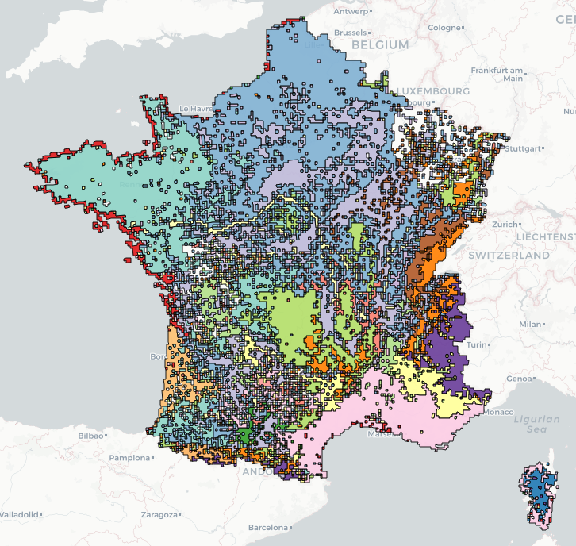

README
================

# __Bioregionalization__ 

# An R package to compare several methods of bioregionalization and estimate the contributions of species

[](https://www.r-project.org/Licenses/GPL-3)
[](https://travis-ci.org/pierredenelle/Bioregionalization)

`Bioregionalization` is a package designed to compare several methods of
clustering based on multivariate or network
approaches.

## 1 Installation

``` r
devtools::install_github("pierredenelle/Bioregionalization", build_vignettes = TRUE)
```

## 2 Tutorial

A tutorial vignette showing the main steps of the processing can be
visualised with the following command line:

``` r
vignette("tutorial", package = "Bioregionalization")
```

    ## Warning: vignette 'tutorial' not found

The .pdf of the vignette can also be accessed
**[here](https://github.com/pierredenelle/Bioregionalization/blob/master/documentation/tutorial_documentation.pdf)**.

## 3 Dependencies

`Bioregionalization` depends on `dplyr`, `ecodist`, `reshape2`,
`DescTools`, `ade4`, `cluster`, `sf`, `ggplot2`, `Rcpp`, `SMUT` and
`igraph`.
