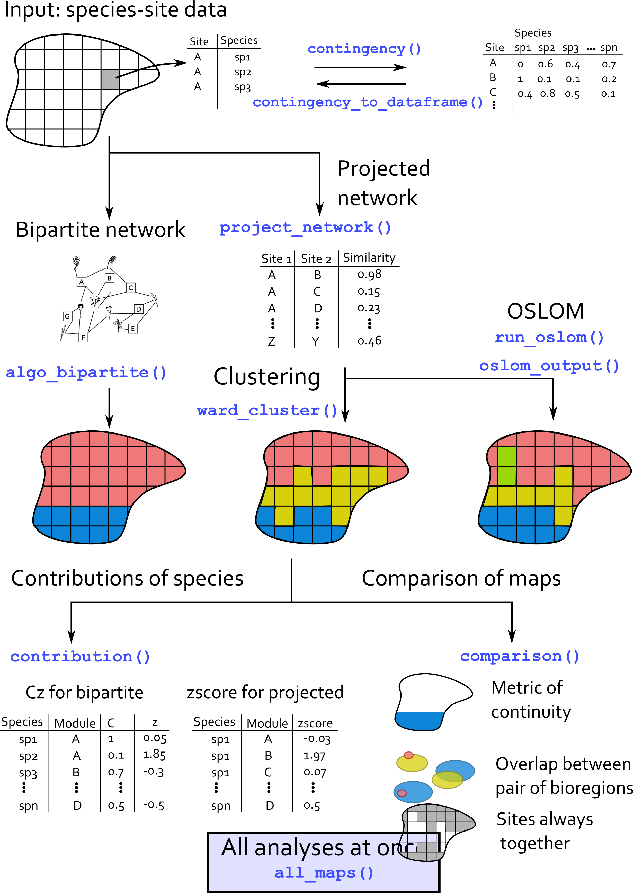
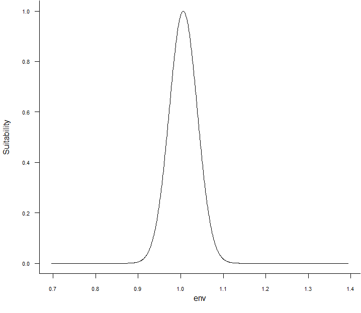
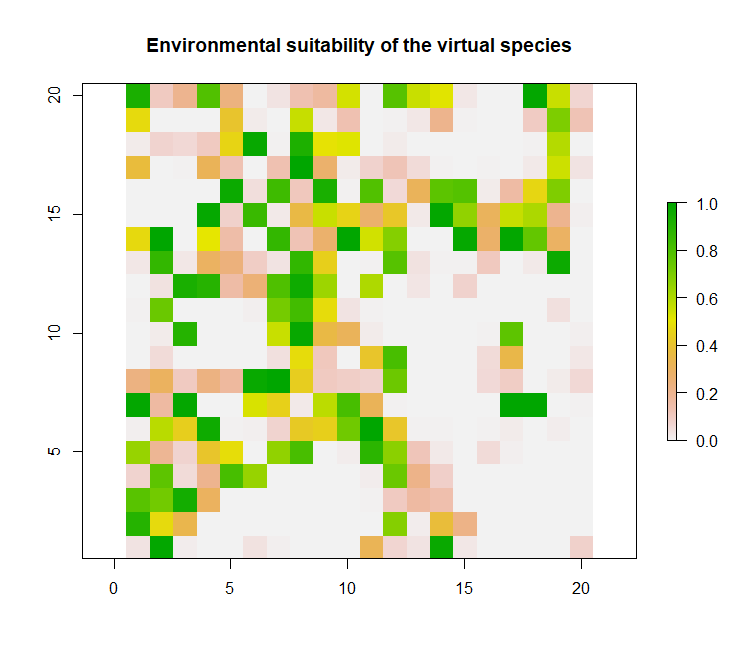
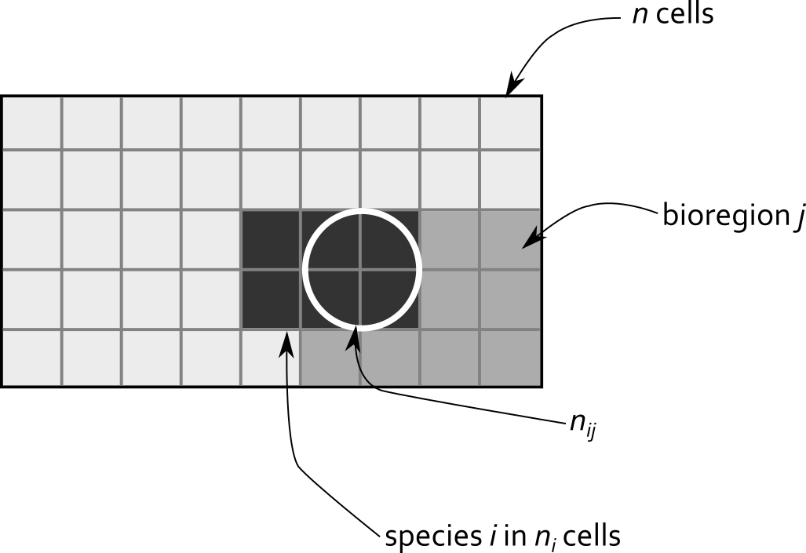

<style>
body {
text-align: justify}
</style>

The principle of the package is illustrated by the following figure.

```{r package_scheme, fig.label = "Workflow of the package."}

```

```{r setup, include=FALSE}

knitr::opts_chunk$set(echo = TRUE, message = FALSE, warning = FALSE,
                      fig.width = 12, fig.height = 12)
# Packages --------------------------------------------------------------------
suppressPackageStartupMessages({
  suppressWarnings({
    library(Bioregionalization)
    library(dplyr)
    library(sf)
    library(ggplot2)
    library(cowplot)
    library(igraph)
    library(RColorBrewer)
  })
})

options(tinytex.verbose = TRUE)

```

# Virtual dataset

`virtual_sp` is a dataset simulated that comes with the package. This dataset
relies on the response curve of virtual species to a virtual raster. The
virtual raster contains 10000 cells and was simulated using `gstat` R package.
[See here for details.](http://santiago.begueria.es/2010/10/generating-spatially-correlated-random-fields-with-r/)

Based on this layer, the `virtualspecies` R package (Leroy et al. 2015) was
used to simulate a Gaussian response curve of 100 virtual species. The mean and
standard deviation of the response function was varying among species, such as
some of them are more or less generalists/specialists.

For every species in every cell, we could derive a suitability index.
Species with suitability index inferior to 0.15 were arbitrarily set absent.

```{r dataset}
# Import virtual dataset
data("virtual_sp")

# Only species data.frame
sp_df <- virtual[[1]]

# Plot of environmental values
sp_df %>%
  distinct(site, .keep_all = TRUE) %>%
  ggplot(aes(x, y)) +
  geom_tile(aes(fill = env, color = env),
            alpha = 0.8, width = 1, height = 1) +
  scale_color_distiller("Value", palette = "OrRd") +
  scale_fill_distiller("Value", palette = "OrRd") +
  coord_equal() +
  labs(title = "Environmental variable") +
  theme(panel.background = element_rect(fill = "transparent",colour = NA))

```

```{r virtual_sp_response_curve, fig.label = "Example of response curve for one virtual species."}

```

```{r virtual_sp_map, fig.label = "Example of suitability map for one virtual species."}

```

The first step is to convert the data.frame into a contingency table.

```{r contingency_matrix}
sp_mat <- contingency(sp_df[which(sp_df$pa != 0), ],
                      "site", "sp", ab = NULL, binary = TRUE)
knitr::kable(sp_mat[1:5, 1:5])

# With weights
sp_mat_w <- contingency(sp_df, "site", "sp", ab = "suitab", binary = FALSE)
knitr::kable(sp_mat_w[1:5, 1:5])
```

# Community detection on projected networks
## Projection of the network

We then need to project the network.

```{r projection}
sp_proj <- project_network(sp_mat, similarity = "simpson")
sp_proj <- sp_proj[, c("id1", "id2", "simpson")]

knitr::kable(head(sp_proj))

sp_proj_w <- project_network(sp_mat_w, similarity = "bray")
sp_proj_w <- sp_proj_w[, c("id1", "id2", "bray")]

knitr::kable(head(sp_proj_w))
```

```{r fig_network_analysis, fig.label = "Steps of the biogeographical network analysis.1.Biogeographical bipartite network where grid cells and species are linked by the presence of a species (or a group of species) in a given grid cell during a certain time window. Note that there is no link between nodes belonging to the same set. 2.The bipartite network is then spatially projected by using a similarity measure of species composition between grid cells.Bioregions are then identified with a network community detection algorithm.3.The test value matrix based on the contribution of species to bioregions is computed. 4. Then, a network of similarity between species is built, based on the test value matrix. Groups of species sharing similar spatial features are identified using a community detection algorithm. 5.Finally, a coarse‐grained biogeographical network unveiling the biogeographical structure of the studied area and the relationship between bioregions is obtained."}
knitr::include_graphics("../figures/Lenormand_et_al_2019_Figure2.png")
```

# Community detection: Order Statistics Local Optimization Method

Running OSLOM. tp files containing the modularity results are directly stored
within the virtual dataset, but the following chunk can be run independently.

Output of OSLOM are stored in a chosen directory and can be import into R with
the command `readRDS()`.

```{r run_OSLOM, eval = FALSE}
run_oslom(sp_proj, n_runs = 5, t_param = 0.1, cp_param = 0.5,
          saving_directory = "D:/PIERRE_DENELLE/CarHab/Bioregionalization_extra/")

res <- readRDS("D:/PIERRE_DENELLE/CarHab/Bioregionalization_extra/tp.rds")
file.rename("D:/PIERRE_DENELLE/CarHab/Bioregionalization_extra/tp.rds",
            "D:/PIERRE_DENELLE/CarHab/Bioregionalization_extra/tp_binary.rds")
# With weights
run_oslom(sp_proj_w, n_runs = 5, t_param = 0.1, cp_param = 0.5,
          saving_directory = "D:/PIERRE_DENELLE/CarHab/Bioregionalization_extra/")

res_w <- readRDS("D:/PIERRE_DENELLE/CarHab/Bioregionalization_extra/tp.rds")

```

Converting the OSLOM .tp file into a list.

```{r conversion_OSLOM}
# Format OSLOM output into a data.frame
oslom_vignette <- oslom_output(virtual[[2]], sp_mat)
# With weights
oslom_vignette_w <- oslom_output(virtual[[3]], sp_mat_w)

print(paste0("Number of bioregions detected = ",
             length(unique(oslom_vignette$bioregion)),
             "; and with weights: ",
             length(unique(oslom_vignette_w$bioregion))))

```

## Species' contributions

Step 3 of Figure 1 (see Lenormand et al. (2019))

```{r zscore_scheme, fig.label = "Principle of the zscore calculation."}

```

$$
\rho_{ij} = \frac{n_{ij} - \frac{n_in_j}{n}}{\sqrt(\frac{n-n_j}{n-1}(1-\frac{n_j}{n})\frac{n_jn_i}{n})}
$$

The interactions between the different bioregions can then be calculated following
these equations:

$$
\hat\rho_{ij}^{+} = {\rho_{ij}}_{\rho_{ij}>1.96}
$$
We normalize the rows:

$$
\hat\rho_{ij}^{+} = \frac{\rho_{ij}^{+}}{\sum_i\rho_{ij}^{+}}
$$

Finally, we determine for each bioregion how each set of species contributes to it.

$$
\lambda_{jj'} = \frac{1}{|A_j|}\sum_{i \in A_{j}}\hat\rho_{jj'}^{+}
$$

```{r z_scores_dummy}

# 10 sites with species richness belonging to [1, 3]
set.seed(1)
sites <- sapply(paste0("site", seq(1:10)),
                function(x) rep(x, sample(c(1:3), 1)))
# Pool of 5 species distributed across the sites
species <- lapply(sites,
                  function(x) sample(paste0("sp", seq(1:5)), 
                                     length(x), replace = TRUE))
# 3 bioregions assigned randomly
bioregions <- sample(paste0("bio", seq(1:3)), length(sites), replace = TRUE)
bioregions <- data.frame(site = names(sites),
                         bioregion = bioregions)

# Conversion to data frame
fuzzy <- data.frame(site = as.character(unlist(sites)),
                    sp = as.character(unlist(species)))
fuzzy <- left_join(fuzzy, bioregions, by = "site")

table(fuzzy$sp, fuzzy$bioregion)

# Compute zscores
zscores <- zscore(fuzzy, sp_col = "sp", site_col = "site",
                  bioregion_col = "bioregion", output_format = "matrix")
zscores

# Interactions between bioregions
interact(input_network = "projected",
         dat = zscores, plot = TRUE, output_format = "matrix")

```

```{r z_scores}
# tmp <- left_join(sp_df, oslom_vignette, by = "site")
tmp <- left_join(sp_df[which(sp_df$pa > 0), ], oslom_vignette, by = "site")
# table(tmp$sp, tmp$bioregion)

z_scores <- zscore(tmp, sp_col = "sp", site_col = "site",
                   bioregion_col = "bioregion", output_format = "dataframe")

top10 <- z_scores %>%
  group_by(bioregion) %>%
  top_n(n = 10, zscore) %>% # extract top 10
  mutate(rank = rank(-zscore, # ranking zcore in an ascending order
                     ties.method = "first")) %>% # if tie zscore, first species
  dplyr::select(sp, bioregion, zscore, rank) %>%
  mutate(zscore = round(zscore, 1)) %>% # rounding zscore to 1 digit
  as.data.frame()

knitr::kable(top10[which(top10$bioregion == "2"), ])

```

## Interaction between bioregions

```{r lambda}
z_scores <- zscore(tmp, sp_col = "sp", site_col = "site",
                   bioregion_col = "bioregion", output_format = "matrix")

lambda <- interact(input_network = "projected",
                   dat = z_scores, plot = TRUE, output_format = "matrix")
knitr::kable(head(lambda[[1]]))
# Plot
lambda[[2]]
```

# Clustering

Example with Ward analysis and k-means clustering.

```{r ward_cluster}
# CA_res <- CA_cluster(sp_mat)
ward_res <- ward_cluster(sp_mat, K.max = 6)
```

# Community detection on bipartite networks
## Several algorithms
Bipartite algorithms applied on example dataset.

```{r bipartite}
# With fastgreedy
bip <- algo_bipartite(dat = sp_mat, algo = "greedy", weight = FALSE)

# With Beckett algorithm
bip2 <- algo_bipartite(dat = sp_mat, algo = "LPAwb", weight = FALSE)

# With Infomap
bip_infomap <- algo_bipartite(dat = sp_mat, algo = "infomap", weight = FALSE)

# Only sites
bip_site <- bip %>%
  filter(cat == "site") %>%
  rename(site = node) %>%
  dplyr::select(site, module)

bip_site2 <- bip2 %>%
  filter(cat == "site") %>%
  rename(site = node) %>%
  dplyr::select(site, module)

bip_site_infomap <- bip_infomap %>%
  filter(cat == "site") %>%
  rename(site = node) %>%
  dplyr::select(site, module)

```

## Species and sites' contributions

Cz computation on bipartite results.

```{r cz}
bip_cz <- bip[, c("node", "module", "cat")]
colnames(bip_cz) <- c("node", "mod", "cat")

cz_bip <- cz(dat = sp_df[which(sp_df$pa > 0), ], sp_col = "sp",
             site_col = "site", bip = bip_cz, ab = NULL)

head(cz_bip[[1]])

# Interaction
# lambda <- interact(input_network = "bipartite",
#                    dat = link_cz, plot = TRUE, output_format = "matrix")
# knitr::kable(head(lambda[[1]]))
# # Plot
# lambda[[2]]

```

# All contributions

```{r contrib}
tmp <- left_join(sp_df[which(sp_df$pa > 0), ], oslom_vignette, by = "site")
# table(tmp$sp, tmp$bioregion)

scores <- contribute(dat = tmp, sp_col = "sp", site_col = "site",
                     bioregion_col = "bioregion")

```

Projection on a map.

```{r map_virtual_dataset}
plot_grid(
  # Plot of environmental values
  sp_df %>%
    distinct(site, .keep_all = TRUE) %>%
    ggplot(aes(x, y)) +
    geom_tile(aes(fill = env, color = env),
              alpha = 0.8, width = 1, height = 1) +
    scale_color_distiller("Value", palette = "OrRd") +
    scale_fill_distiller("Value", palette = "OrRd") +
    coord_equal() +
    labs(title = "Environmental variable") +
    theme(panel.background = element_rect(fill = "transparent",colour = NA)),
  
  # Plot of OSLOM bioregions
  sp_df %>%
    left_join(oslom_vignette, by = "site") %>%
    distinct(site, .keep_all = TRUE) %>%
    ggplot(aes(x, y)) +
    geom_tile(aes(fill = as.factor(bioregion), color = as.factor(bioregion)),
              alpha = 0.8, width = 1, height = 1) +
    scale_color_brewer("Bioregions", palette = "Paired") +
    scale_fill_brewer("Bioregions", palette = "Paired") +
    # scale_color_viridis_d("Bioregions", option = "E") +
    # scale_fill_viridis_d("Bioregions", option = "E") +
    coord_equal() +
    labs(title = "OSLOM bioregions") +
    theme(panel.background = element_rect(fill = "transparent",
                                          colour = "black")),
  
  # Plot of Ward bioregions
  sp_df %>%
    left_join(ward_res, by = "site") %>%
    distinct(site, .keep_all = TRUE) %>%
    ggplot(aes(x, y)) +
    geom_tile(aes(fill = as.factor(cluster), color = as.factor(cluster)),
              alpha = 0.8, width = 1, height = 1) +
    scale_color_brewer("Bioregions", palette = "Paired") +
    scale_fill_brewer("Bioregions", palette = "Paired") +
    coord_equal() +
    labs(title = "Ward bioregions") +
    theme(panel.background = element_rect(fill = "transparent", colour = NA)),
  
  # Plot of fastgreedy bioregions
  sp_df %>%
    left_join(bip_site, by = "site") %>%
    distinct(site, .keep_all = TRUE) %>%
    ggplot(aes(x, y)) +
    geom_tile(aes(fill = as.factor(module), color = as.factor(module)),
              alpha = 0.8, width = 1, height = 1) +
    scale_color_brewer("Bioregions", palette = "Paired") +
    scale_fill_brewer("Bioregions", palette = "Paired") +
    coord_equal() +
    labs(title = "Bipartite greedy bioregions") +
    theme(panel.background = element_rect(fill = "transparent", colour = NA)),
  
  # Plot of LPAwb bioregions
  sp_df %>%
    left_join(bip_site2, by = "site") %>%
    distinct(site, .keep_all = TRUE) %>%
    ggplot(aes(x, y)) +
    geom_tile(aes(fill = as.factor(module), color = as.factor(module)),
              alpha = 0.8, width = 1, height = 1) +
    scale_color_brewer("Bioregions", palette = "Paired") +
    scale_fill_brewer("Bioregions", palette = "Paired") +
    coord_equal() +
    labs(title = "LPAwb+ greedy bioregions") +
    theme(panel.background = element_rect(fill = "transparent", colour = NA)),
  
  # Plot of Infomap bioregions
  sp_df %>%
    left_join(bip_site_infomap, by = "site") %>%
    distinct(site, .keep_all = TRUE) %>%
    ggplot(aes(x, y)) +
    geom_tile(aes(fill = as.factor(module), color = as.factor(module)),
              alpha = 0.8, width = 1, height = 1) +
    scale_color_brewer("Bioregions", palette = "Paired") +
    scale_fill_brewer("Bioregions", palette = "Paired") +
    coord_equal() +
    labs(title = "Infomap bioregions") +
    theme(panel.background = element_rect(fill = "transparent", colour = NA)),
  
  nrow = 2)

```

# Comparison of different bioregionalizations

```{r comparison, eval = TRUE}
# Gather all the bioregionalizations
all_bioregions <- sp_df %>%
  select(site, x, y, env) %>%
  distinct(site, .keep_all = TRUE) %>%
  left_join(oslom_vignette, by = "site") %>% # add OSLOM
  rename(oslom = bioregion) %>%
  left_join(ward_res, by = "site") %>% # add Ward
  rename(ward = cluster) %>%
  left_join(bip_site, by = "site") %>% # add greedy
  distinct(site, .keep_all = TRUE) %>%
  rename(greedy = module) %>%
  left_join(bip_site2, by = "site") %>% # add LPAwb
  distinct(site, .keep_all = TRUE) %>%
  rename(lpawb = module) %>%
  left_join(bip_site_infomap, by = "site") %>% # add infomap
  distinct(site, .keep_all = TRUE) %>%
  rename(infomap = module)

# Test of comparison function
all100 <- comparison(all_bioregions, bio_col = c(5:9))

# Comparison of maps
plot_grid(
  # Plot of OSLOM bioregions
  sp_df %>%
    left_join(oslom_vignette, by = "site") %>%
    distinct(site, .keep_all = TRUE) %>%
    ggplot(aes(x, y)) +
    geom_tile(aes(fill = as.factor(bioregion), color = as.factor(bioregion)),
              alpha = 0.8, width = 1, height = 1) +
    scale_color_brewer("Bioregions", palette = "Paired") +
    scale_fill_brewer("Bioregions", palette = "Paired") +
    # scale_color_viridis_d("Bioregions", option = "E") +
    # scale_fill_viridis_d("Bioregions", option = "E") +
    coord_equal() +
    labs(title = "OSLOM bioregions") +
    theme(panel.background = element_rect(fill = "transparent",
                                          colour = "black")),
  
  # Identical pairs of plots
  all100 %>%
    left_join(all_bioregions[, c("site", "x", "y")], by = c("id1" = "site")) %>%
    distinct(id1, .keep_all = TRUE) %>%
    ggplot(aes(x, y)) +
    geom_tile(aes(fill = as.factor(pair_bio), color = as.factor(pair_bio)),
              alpha = 0.8, width = 1, height = 1) +
    scale_color_viridis_d("Bioregions", option = "E") +
    scale_fill_viridis_d("Bioregions", option = "E") +
    # scale_color_brewer("Bioregions", palette = "Paired") +
    # scale_fill_brewer("Bioregions", palette = "Paired") +
    coord_equal() +
    labs(title = "Identical bioregions") +
    theme(panel.background = element_rect(fill = "transparent", colour = NA)),
  
  # Plot of Ward bioregions
  sp_df %>%
    left_join(ward_res, by = "site") %>%
    distinct(site, .keep_all = TRUE) %>%
    ggplot(aes(x, y)) +
    geom_tile(aes(fill = as.factor(cluster), color = as.factor(cluster)),
              alpha = 0.8, width = 1, height = 1) +
    scale_color_brewer("Bioregions", palette = "Paired") +
    scale_fill_brewer("Bioregions", palette = "Paired") +
    coord_equal() +
    labs(title = "Ward bioregions") +
    theme(panel.background = element_rect(fill = "transparent", colour = NA)),
  
  # Plot of fastgreedy bioregions
  sp_df %>%
    left_join(bip_site, by = "site") %>%
    distinct(site, .keep_all = TRUE) %>%
    ggplot(aes(x, y)) +
    geom_tile(aes(fill = as.factor(module), color = as.factor(module)),
              alpha = 0.8, width = 1, height = 1) +
    scale_color_brewer("Bioregions", palette = "Paired") +
    scale_fill_brewer("Bioregions", palette = "Paired") +
    coord_equal() +
    labs(title = "Bipartite greedy bioregions") +
    theme(panel.background = element_rect(fill = "transparent", colour = NA)),
  
  # Plot of LPAwb bioregions
  sp_df %>%
    left_join(bip_site2, by = "site") %>%
    distinct(site, .keep_all = TRUE) %>%
    ggplot(aes(x, y)) +
    geom_tile(aes(fill = as.factor(module), color = as.factor(module)),
              alpha = 0.8, width = 1, height = 1) +
    scale_color_brewer("Bioregions", palette = "Paired") +
    scale_fill_brewer("Bioregions", palette = "Paired") +
    coord_equal() +
    labs(title = "LPAwb+ greedy bioregions") +
    theme(panel.background = element_rect(fill = "transparent", colour = NA)),
  
  # Plot of Infomap bioregions
  sp_df %>%
    left_join(bip_site_infomap, by = "site") %>%
    distinct(site, .keep_all = TRUE) %>%
    ggplot(aes(x, y)) +
    geom_tile(aes(fill = as.factor(module), color = as.factor(module)),
              alpha = 0.8, width = 1, height = 1) +
    scale_color_brewer("Bioregions", palette = "Paired") +
    scale_fill_brewer("Bioregions", palette = "Paired") +
    coord_equal() +
    labs(title = "Infomap bioregions") +
    theme(panel.background = element_rect(fill = "transparent", colour = NA)),
  
  nrow = 2)

# Plot with tiles
all100 %>%
  left_join(all_bioregions[, c("site", "x", "y")], by = c("id1" = "site")) %>%
  distinct(id1, .keep_all = TRUE) %>%
  st_as_sf(coords = c("x", "y")) %>%
  group_by(pair_bio) %>%
  st_cast("MULTIPOINT") %>%
  summarise() %>%
  ggplot() +
  geom_sf(aes(color = as.factor(pair_bio)))
geom_tile(aes(fill = as.factor(pair_bio), color = as.factor(pair_bio)),
          alpha = 0.8, width = 1, height = 1)

```

```{r autocorrelation, eval = TRUE}

## Autocorrelation
# https://mgimond.github.io/Spatial/spatial-autocorrelation-in-r.html
library(sp)
all_bioregions_sp <- all_bioregions
all_bioregions_sp <- all_bioregions_sp[complete.cases(all_bioregions_sp), ]
coordinates(all_bioregions_sp) <- ~x+y

all_bioregions_sp$oslom <- as.numeric(as.character(all_bioregions_sp$oslom))
all_bioregions_sp$ward <- as.numeric(as.character(all_bioregions_sp$ward))
all_bioregions_sp$greedy <- as.numeric(as.character(all_bioregions_sp$greedy))
all_bioregions_sp$lpawb <- as.numeric(as.character(all_bioregions_sp$lpawb))
all_bioregions_sp$infomap <- as.numeric(as.character(all_bioregions_sp$infomap))

coo <- coordinates(all_bioregions_sp)
# S.dist  <-  spdep::dnearneigh(coo, 0, 100)
# lw <- spdep::nb2listw(S.dist, style="W",zero.policy=T) 
# MI  <-  spdep::moran.mc(all_bioregions_sp$oslom, lw, nsim=599,zero.policy=T)
# plot(MI, main = "", las = 1) 

bws <- c(3, 4, 6, 9, 12, 18, 24)
moran_oslom <- lctools::moransI.v(coo, bws, all_bioregions_sp@data$oslom)
moran_ward <- lctools::moransI.v(coo, bws, all_bioregions_sp@data$ward)
moran_greedy <- lctools::moransI.v(coo, bws, all_bioregions_sp@data$greedy)
moran_lpawb <- lctools::moransI.v(coo, bws, all_bioregions_sp@data$lpawb)
moran_infomap <- lctools::moransI.v(coo, bws, all_bioregions_sp@data$infomap)

all_moran <-
  rbind(data.frame(
    algo = "oslom", k = moran_oslom[, "k"],
    moran = moran_oslom[, "Moran's I"]),
    data.frame(algo = "ward", k = moran_ward[, "k"],
               moran = moran_ward[, "Moran's I"]),
    data.frame(algo = "ward", k = moran_ward[, "k"],
               moran = moran_greedy[, "Moran's I"]),
    data.frame(algo = "greedy", k = moran_greedy[, "k"],
               moran = moran_lpawb[, "Moran's I"]),
    data.frame(algo = "infomap", k = moran_infomap[, "k"],
               moran = moran_infomap[, "Moran's I"])
  )

ggplot(all_moran, aes(k, moran)) +
  geom_line(aes(color = as.factor(algo))) +
  geom_point(aes(color = as.factor(algo))) +
  scale_color_viridis_d("Method") +
  labs(x = "# of neighbours", y = "Moran's I") +
  theme_classic() +
  theme(panel.border = element_rect(fill= NA, color = "black"))

```

We can as well compare each pair of bioregion to each other.

```{r pair_sabre, eval = FALSE}
# sabre package: test between oslom and ward
# Spatial Association Between REgionalizations
library(sabre)
library(sf)

bioregions_sf <- st_as_sf(all_bioregions, coords = c("x", "y")) %>%
  st_cast(to = "MULTILINESTRING")

po <- vmeasure_calc(x = bioregions_sf, x_name = oslom,
                    y = bioregions_sf, y_name = ward)

# Groups of pixels through the different methods
list_group_oslom <- by(all_bioregions$site, all_bioregions$oslom, identity)
list_group_oslom <- lapply(list_group_oslom, as.character)

list_group_ward <- by(all_bioregions$site, all_bioregions$ward, identity)
list_group_ward <- lapply(list_group_ward, as.character)

list_group_greedy <- by(all_bioregions$site, all_bioregions$greedy, identity)
list_group_greedy<- lapply(list_group_greedy, as.character)

list_group_lpawb <- by(all_bioregions$site, all_bioregions$lpawb, identity)
list_group_lpawb <- lapply(list_group_lpawb, as.character)

list_group_infomap <- by(all_bioregions$site, all_bioregions$infomap, identity)
list_group_infomap <- lapply(list_group_infomap, as.character)

list_combined <- lapply(list_group_oslom, function(x) x[x %in% list_group_ward[[1]]])
list_combined <- lapply(list_combined, function(x) x[x %in% list_group_greedy[[1]]])
list_combined <- lapply(list_combined, function(x) x[x %in% list_group_lpawb[[1]]])
list_combined <- lapply(list_combined, function(x) x[x %in% list_group_infomap[[1]]])

# For one combination only
list1_oslom <-
  all_bioregions[which(all_bioregions$oslom == unique(all_bioregions$oslom)[1]),
                 "site"]
list1_ward <- all_bioregions[which(all_bioregions$ward == unique(all_bioregions$ward)[1]),
                             "site"]
list1_greedy <- all_bioregions[which(all_bioregions$greedy == unique(all_bioregions$greedy)[1]),
                               "site"]
list1_lpawb <- all_bioregions[which(all_bioregions$lpawb == unique(all_bioregions$lpawb)[1]),
                              "site"]
list1_infomap <- all_bioregions[which(all_bioregions$infomap == unique(all_bioregions$infomap)[1]),
                                "site"]

list1_combined <- list1_oslom[list1_oslom %in% list1_ward]
list1_combined <- list1_combined[list1_combined %in% list1_greedy]
list1_combined <- list1_combined[list1_combined %in% list1_lpawb]
list1_combined <- list1_combined[list1_combined %in% list1_infomap]

all_bioregions$combined <- NA
all_bioregions[which(all_bioregions$site %in% list1_combined), "combined"] <- "1"

```

# Run all the steps together

All these functions can be called with the wrap-up `all_maps()` function.

```{r all_maps, eval = FALSE}
all_res <- all_maps(dat = sp_df, form = "tidy", site, sp, ab = NULL,
                    binary = TRUE,
                    similarity = "simpson", network_algo = "both",
                    saving_directory,
                    bipartite_algo = "greedy", weight = FALSE,
                    clustering = TRUE, ward_method = "ward.D2",
                    optim_method = "firstSEmax", nstart = 25, B = 50,
                    K.max = 20)
```
